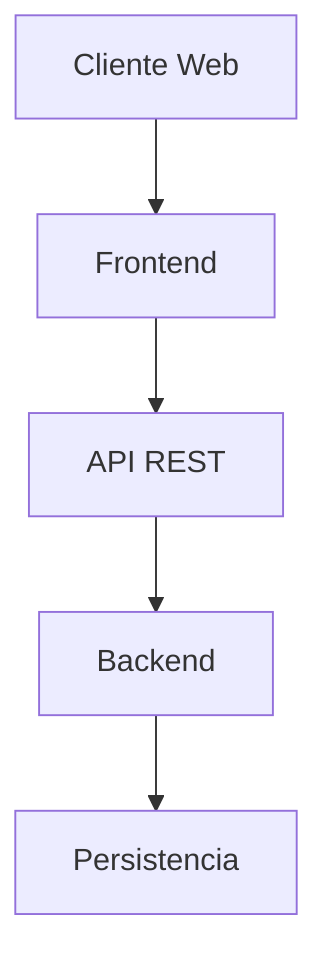
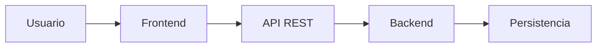

# Arquitectura del Sistema

Versión 2.0

---

# 1. Introducción

## 1.1 Propósito

Este documento describe la arquitectura lógica del sistema **AUMA**, definiendo la organización de sus componentes, la comunicación entre ellos, los principios de diseño adoptados y las principales decisiones arquitectónicas del proyecto.

Su propósito es proporcionar una visión integral de la estructura del sistema para facilitar su comprensión, evolución y mantenimiento.

## 1.2 Alcance

Este documento abarca:

- la arquitectura general del sistema;
- los componentes principales y sus responsabilidades;
- la comunicación entre componentes;
- los patrones arquitectónicos utilizados;
- las decisiones arquitectónicas adoptadas;
- los principales flujos funcionales del sistema.

La infraestructura física, los servicios cloud, la distribución de componentes y la configuración de la plataforma se documentan en:

[`14-arquitectura-fisica.md`](14-arquitectura-fisica.md)

---

# 2. Principios Arquitectónicos

La arquitectura de AUMA se diseñó siguiendo una serie de principios orientados a construir un sistema mantenible, escalable y desacoplado.

Los principios adoptados son:

- Separación de responsabilidades entre frontend, backend y persistencia.
- Arquitectura desacoplada mediante una API REST.
- Componentes reutilizables y modulares.
- Escalabilidad horizontal mediante servicios serverless.
- Minimización de costos operativos utilizando servicios administrados.
- Evolución incremental del sistema mediante un roadmap definido.
- Diseño orientado a facilitar el mantenimiento y futuras ampliaciones del proyecto.

---

# 3. Arquitectura General

## 3.1 Descripción

AUMA adopta una arquitectura desacoplada basada en una aplicación frontend independiente que consume una API REST para acceder a la lógica de negocio y a la capa de persistencia.

Esta organización permite desarrollar, desplegar y evolucionar cada componente de forma independiente, favoreciendo la escalabilidad, el mantenimiento y la incorporación de nuevas funcionalidades sin afectar al resto del sistema.

La arquitectura fue diseñada considerando las necesidades del MVP y el crecimiento previsto en el roadmap del proyecto.

## 3.2 Diagrama de arquitectura



## 3.3 Características

La arquitectura del sistema presenta las siguientes características:

- Arquitectura desacoplada entre presentación, lógica de negocio y persistencia.
- Comunicación mediante API REST.
- Componentes independientes y reutilizables.
- Diseño preparado para escalar horizontalmente.
- Separación clara de responsabilidades.
- Evolución incremental mediante funcionalidades incorporadas por fases.
- Compatibilidad con una infraestructura serverless documentada en la arquitectura física.

---


# 4. Componentes del Sistema

## 4.1 Frontend

El frontend constituye la capa de presentación del sistema y representa el punto de interacción entre el usuario y AUMA.

Sus principales responsabilidades son:

- presentar la interfaz de usuario;
- consumir la API del sistema;
- gestionar la navegación entre vistas;
- administrar el estado de la aplicación;
- gestionar el carrito de compras durante la sesión del usuario.

La implementación técnica del frontend se documenta en el Manual Técnico.

## 4.2 Backend

El backend concentra la lógica de negocio del sistema y expone los servicios necesarios para que el frontend pueda operar.

Entre sus responsabilidades principales se encuentran:

- administrar productos y variantes;
- gestionar pedidos;
- validar reglas de negocio;
- interactuar con la capa de persistencia;
- coordinar las integraciones externas del sistema.

La implementación técnica del backend se documenta en el Manual Técnico.

## 4.3 Persistencia

La capa de persistencia es responsable del almacenamiento y recuperación de la información utilizada por el sistema.

Su diseño contempla:

- productos y variantes;
- categorías y líneas de productos;
- recipientes y fragancias;
- clientes;
- pedidos e ítems de pedido.

El modelo completo de datos se documenta en:

[`09-modelado-sistema.md`](09-modelado-sistema.md)

## 4.4 Integraciones

La arquitectura contempla la integración con servicios externos necesarios para el funcionamiento del sistema.

Las principales integraciones previstas son:

- pasarela de pagos;
- servicios de autenticación;
- servicios de almacenamiento;
- servicios de monitoreo;
- servicios de notificación.

Las características de implementación e infraestructura de estas integraciones se documentan en:

[`14-arquitectura-fisica.md`](14-arquitectura-fisica.md)

# 5. Comunicación entre Componentes

Los componentes principales del sistema interactúan mediante interfaces claramente definidas, manteniendo un bajo acoplamiento entre las distintas capas de la aplicación.

El flujo general de comunicación es el siguiente:



## Flujo de comunicación

1. El usuario interactúa con la interfaz web.
2. El frontend procesa la interacción y realiza solicitudes a la API REST.
3. El backend recibe la solicitud, aplica la lógica de negocio correspondiente y accede a la capa de persistencia cuando es necesario.
4. La información resultante es devuelta al frontend para su presentación al usuario.

Esta separación permite que cada componente evolucione de manera independiente, favoreciendo el mantenimiento, las pruebas y la escalabilidad del sistema.


---

# 6. Patrones Arquitectónicos

La arquitectura de AUMA adopta una serie de patrones que favorecen la modularidad, el desacoplamiento y la evolución del sistema.

| Patrón | Aplicación en AUMA |
|---------|--------------------|
| SPA (Single Page Application) | El frontend se implementa como una aplicación React de página única. |
| Cliente–Servidor | El frontend consume los servicios expuestos por el backend mediante una API REST. |
| REST | La comunicación entre frontend y backend se realiza mediante endpoints REST. |
| Serverless | La lógica de negocio se implementa mediante funciones ejecutadas bajo demanda. |
| Stateless | Cada solicitud es procesada de forma independiente, sin mantener estado en el servidor. |
| Arquitectura por capas | Separación entre presentación, lógica de negocio y persistencia. |
| Componentes desacoplados | Cada componente puede evolucionar independientemente siempre que respete las interfaces definidas. |


---

# 7. Decisiones Arquitectónicas

Durante el diseño de AUMA se adoptaron una serie de decisiones arquitectónicas orientadas a construir un sistema escalable, mantenible y preparado para evolucionar de forma incremental.

| Decisión | Justificación |
|----------|---------------|
| Separar el frontend y el backend en proyectos independientes. | Permite desarrollar, desplegar y mantener cada componente de forma independiente, reduciendo el acoplamiento entre capas. |
| Implementar una API REST como interfaz de comunicación. | Facilita la interoperabilidad entre componentes y permite incorporar nuevos clientes sin modificar la lógica de negocio. |
| Adoptar una arquitectura serverless. | Reduce costos operativos, elimina la administración de servidores y permite escalar automáticamente según la demanda. |
| Centralizar la lógica de negocio en el backend. | Evita duplicación de reglas, mejora la mantenibilidad y garantiza un comportamiento consistente del sistema. |
| Mantener la persistencia desacoplada de la interfaz de usuario. | Permite modificar la tecnología de almacenamiento sin afectar el resto de la arquitectura. |
| Diseñar el sistema para evolucionar por fases. | Facilita la entrega incremental de funcionalidades siguiendo el roadmap del proyecto y priorizando el desarrollo del MVP. |

---

# 8. Seguridad

La arquitectura de AUMA incorpora una estrategia de seguridad orientada a proteger la comunicación entre los distintos componentes del sistema y garantizar el acceso controlado a los recursos disponibles.

## 8.1 Control de acceso

La arquitectura contempla la aplicación del principio de mínimo privilegio para todos los componentes del sistema, limitando el acceso de cada servicio únicamente a los recursos necesarios para cumplir su función.

## 8.2 Protección de la API

La comunicación entre el frontend y el backend incorpora mecanismos destinados a proteger las interfaces públicas del sistema, incluyendo:

- restricciones de CORS;
- validación de solicitudes;
- limitación de tasa de solicitudes (rate limiting);
- validación de datos recibidos por la API.

## 8.3 Autenticación y autorización

Durante el MVP el sistema no requiere autenticación de usuarios finales.

La autenticación y autorización se incorporarán en etapas posteriores del proyecto, de acuerdo con el roadmap definido, permitiendo gestionar clientes registrados y funcionalidades administrativas protegidas.

Los detalles de implementación y configuración de la infraestructura de seguridad se documentan en:

- [`14-arquitectura-fisica.md`](14-arquitectura-fisica.md)
- [`19-manual-tecnico.md`](19-manual-tecnico.md)


# 9. Flujos Principales

A continuación se describen los principales flujos funcionales contemplados por la arquitectura del sistema.

## 8.1 Consulta de productos

```text
Usuario
    │
    ▼
Frontend
    │
    ▼
API REST
    │
    ▼
Backend
    │
    ▼
Persistencia
    │
    ▼
Respuesta al Frontend
````

El usuario navega por el catálogo y consulta la información de los productos. El frontend solicita los datos mediante la API REST, el backend procesa la solicitud y obtiene la información desde la capa de persistencia antes de devolver la respuesta al cliente.

---

## 8.2 Gestión del carrito

```text
Usuario
    │
    ▼
Frontend
```

Durante el MVP, el carrito de compras se administra íntegramente en el frontend, manteniendo el estado de la compra durante la sesión del usuario.

---

## 8.3 Creación de pedidos

```text
Usuario
    │
    ▼
Frontend
    │
    ▼
API REST
    │
    ▼
Backend
    │
    ▼
Persistencia
```

Una vez confirmado el proceso de compra, el frontend envía la información del pedido a la API REST, donde el backend valida los datos y registra el pedido en la capa de persistencia.

---

## 8.4 Confirmación de pago (Post-MVP)

```text
Pasarela de Pago
        │
        ▼
Webhook
        │
        ▼
API REST
        │
        ▼
Backend
        │
        ▼
Persistencia
```

En las etapas posteriores al MVP, la pasarela de pago notificará el resultado de la transacción mediante un webhook. El backend validará la notificación y actualizará el estado del pedido correspondiente.

---


# 10. Documentos Relacionados

La arquitectura del sistema se complementa con los siguientes documentos del proyecto:

- [`09-modelado-sistema.md`](09-modelado-sistema.md)
- [`14-arquitectura-fisica.md`](14-arquitectura-fisica.md)
- [`16-roadmap.md`](16-roadmap.md)
- [`19-manual-tecnico.md`](19-manual-tecnico.md)

---

# 11. Autoría

Este documento forma parte de la documentación oficial del proyecto **AUMA**, desarrollado por **Gabycrem Software** bajo la metodología **Gabycrem Engineering**.

## Organización

Gabycrem Software

## Proyecto

AUMA

## Autora

Nazarena Macre

## Portafolio profesional

GitHub: https://github.com/Gabycrem

LinkedIn: https://www.linkedin.com/in/macrenazarena/

---

<div align="center">

`Siempre construyendo, siempre aprendiendo. — GABYCREM®`

</div>

---

# 12. Historial de cambios

| Versión | Fecha | Cambio | Autor |
|----------|------------|------------------------------------------------------------|----------------|
| 2.0 | 2026-06-29 | Adaptación del documento al estándar Gabycrem Engineering. | Nazarena Macre |
| 1.0 | 2025-11-28 | Creación del documento. | Nazarena Macre |


