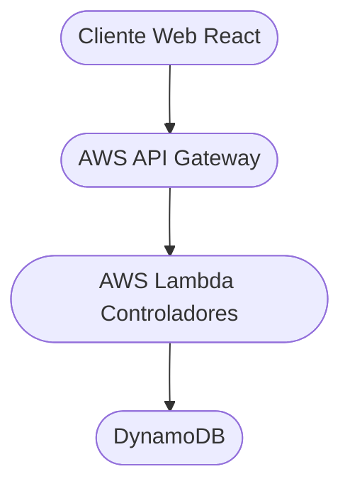

# 19 – Manual Técnico del Sistema AUMA  
Versión 1.0

---

## 1. Introducción

Este manual técnico describe la arquitectura, tecnologías, estructuras internas y funcionamiento del sistema e-commerce **AUMA**, incluyendo los componentes frontend, backend serverless y base de datos.  
Su propósito es proporcionar información clara para desarrolladores, técnicos, mantenedores y futuros colaboradores.

---

# 2. Arquitectura General del Sistema

AUMA utiliza una arquitectura basada en servicios desacoplados:




Características:
- Sin servidores dedicados (serverless).
- Escalabilidad automática.
- Bajos costos de operación.
- Integración con servicios nativos de AWS.

---

# 3. Frontend

## 3.1. Descripción

El frontend de AUMA es una **SPA desarrollada en React**, desplegada en **AWS Amplify Hosting**.

Se encarga de:
- Mostrar catálogo
- Filtrar productos
- Mostrar ficha de producto
- Gestionar carrito
- Iniciar checkout
- Integrarse con la API

## 3.2. Estructura del proyecto

```
src/
├── components/
├── pages/
│ ├── Home.jsx
│ ├── Catalogo.jsx
│ ├── Producto.jsx
│ ├── Carrito.jsx
│ ├── Checkout.jsx
│ └── Confirmacion.jsx
├── hooks/
├── services/
│ └── api.js
└── context/
└── carritoContext.jsx
```

---

# 4. Backend

## 4.1. Tecnologías utilizadas

- **AWS Lambda** – Lógica de negocio
- **AWS API Gateway** – Endpoints REST
- **DynamoDB** – Base de datos NoSQL
- **AWS IAM** – Permisos
- **AWS CloudWatch** – Logs & métricas

## 4.2. Endpoints previstos (MVP + post-MVP)

- GET /productos
- GET /productos/:id
- GET /productos/:id/variantes
- POST /carrito
- POST /pedidos
- POST /pagos/webhook
- GET /pedidos/:id

- ADMIN (requiere auth)
- POST /admin/productos
- PUT /admin/productos/:id
- DELETE /admin/productos/:id
- GET /admin/pedidos
- PUT /admin/pedidos/:id


## 4.3. Estructura de Lambdas

```
/lambdas
├── productos/
│ ├── getProductos.js
│ ├── getProductoById.js
│ └── getVariantes.js
├── pedidos/
│ ├── crearPedido.js
│ ├── getPedido.js
│ └── updatePedido.js
├── pagos/
│ └── webhookPago.js
└── admin/
├── crearProducto.js
├── editarProducto.js
├── eliminarProducto.js
└── listarPedidos.js
```


---

# 5. Base de Datos (Modelo Lógico)

## 5.1. Entidades

### Tablas principales:

- Categorias  
- Lineas  
- Recipientes  
- Fragancias  
- Productos  
- VariantesProducto  
- Clientes  
- Pedidos  
- ItemsPedido  

El modelo completo está documentado en  
`09-modelado-sistema.md`

---

# 6. Despliegue

## 6.1. Frontend

- AWS Amplify Hosting
- Deploy automático al hacer `push` en rama `main`
- Builds con Vite

## 6.2. Backend

- AWS Lambda (Node.js)
- API Gateway (REST)
- DynamoDB tablas separadas por dominio
- IAM roles para permisos específicos

## 6.3. Webhooks de Pago

- Endpoint dedicado en `/pagos/webhook`
- Validación de firma y origen
- Actualización del pedido → estado “pagado”

---

# 7. Logs y Monitoreo

- **CloudWatch Logs** para Lambdas  
- **CloudWatch Metrics** para:
  - invocaciones
  - errores
  - throttling
  - duración
- Alarmas opcionales por sobrecostos o errores

---

# 8. Mantenimiento

- Actualización de dependencias cada sprint
- Revisión periódica de costos AWS
- Limpieza de tablas no utilizadas
- Rotación de claves y políticas IAM
- Optimización de rendimiento (consultas Dynamo)

---

# 9. Créditos

Documentación técnica desarrollada por:

**Gabycrem®**  
Desarrollo, organización y dirección del proyecto AUMA.

- GitHub: https://github.com/Gabycrem  
- LinkedIn: https://www.linkedin.com/in/macrenazarena/

---

<div align="center">
<code>Siempre construyendo, siempre aprendiendo. -- GABYCREM® </code>
</div>
