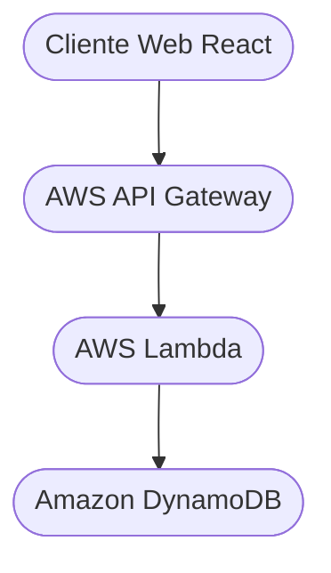

# Manual Técnico del Sistema

Versión 2.0

---

# 1. Introducción

## 1.1 Propósito

Este manual técnico documenta la arquitectura, tecnologías, componentes e infraestructura del sistema **AUMA**.

Su propósito es proporcionar una referencia técnica centralizada para desarrolladores, mantenedores y futuros colaboradores, facilitando la comprensión del funcionamiento interno del sistema y sirviendo como soporte para las tareas de desarrollo, mantenimiento y evolución del proyecto.

La información contenida en este documento deberá mantenerse sincronizada con la evolución del software y actualizarse ante cualquier cambio significativo en la arquitectura o en los componentes del sistema.

## 1.2 Objetivos

Este documento tiene como objetivos:

- Documentar la arquitectura general del sistema.
- Identificar las tecnologías utilizadas en cada componente.
- Describir la estructura del frontend y del backend.
- Documentar la infraestructura de despliegue.
- Centralizar la información técnica relevante del proyecto.
- Facilitar la incorporación de nuevos desarrolladores.
- Servir como referencia para tareas de mantenimiento y futuras ampliaciones del sistema.

---

# 2. Arquitectura General

## 2.1 Descripción

AUMA implementa una arquitectura desacoplada basada en servicios **serverless** sobre AWS, separando claramente las responsabilidades entre la interfaz de usuario, la lógica de negocio y la capa de persistencia.

La aplicación se compone de un frontend desarrollado en React, un backend implementado mediante funciones AWS Lambda expuestas a través de API Gateway y una base de datos NoSQL en DynamoDB.

Esta arquitectura permite:

- Escalabilidad automática según la demanda.
- Reducción de costos operativos al no requerir servidores dedicados.
- Independencia entre frontend y backend.
- Facilidad para desplegar nuevas versiones de forma continua.
- Integración nativa con los servicios administrados de AWS.

## 2.2 Diagrama de arquitectura


```mermaid
flowchart TD
    A([Cliente Web React]) --> B([AWS API Gateway])
    B --> C([AWS Lambda])
    C --> D([Amazon DynamoDB])
```

## 2.3 Características

* Arquitectura serverless basada en AWS.
* Frontend desacoplado del backend mediante API REST.
* Backend compuesto por funciones AWS Lambda independientes.
* Persistencia mediante Amazon DynamoDB.
* Escalabilidad automática de los servicios.
* Integración con servicios administrados de AWS.
* Infraestructura preparada para incorporar nuevos módulos sin afectar los componentes existentes.

---

# 3. Tecnologías Utilizadas

La siguiente tabla resume las principales tecnologías empleadas en el desarrollo e infraestructura del sistema AUMA.

| Área                 | Tecnología          | Versión | Propósito                                   |
| -------------------- | ------------------- | ------- | ------------------------------------------- |
| Frontend             | React               | 19      | Desarrollo de la interfaz de usuario (SPA). |
| Frontend             | Vite                | 7       | Herramienta de desarrollo y compilación.    |
| Backend              | Node.js             | 22      | Ejecución de funciones Lambda.              |
| Backend              | AWS Lambda          | -       | Implementación de la lógica de negocio.     |
| API                  | AWS API Gateway     | -       | Exposición de la API REST.                  |
| Base de Datos        | Amazon DynamoDB     | -       | Persistencia de la información del sistema. |
| Infraestructura      | AWS Amplify Hosting | -       | Hosting y despliegue del frontend.          |
| Infraestructura      | AWS IAM             | -       | Gestión de permisos y seguridad.            |
| Observabilidad       | AWS CloudWatch      | -       | Logs, monitoreo y métricas del sistema.     |
| Control de versiones | Git                 | -       | Gestión del código fuente.                  |
| Repositorio          | GitHub              | -       | Almacenamiento y versionado del proyecto.   |


---
# 4. Frontend

## 4.1 Descripción

El frontend de AUMA es una **Single Page Application (SPA)** desarrollada en **React**, responsable de la interacción con el usuario y de la comunicación con la API del sistema.

La aplicación está desplegada mediante **AWS Amplify Hosting** y consume los servicios expuestos por el backend a través de AWS API Gateway.

Su diseño prioriza una experiencia de usuario simple, intuitiva y responsiva, facilitando el proceso de navegación, compra y administración del catálogo.

## 4.2 Responsabilidades

El frontend es responsable de:

- Mostrar el catálogo de productos.
- Permitir la navegación entre categorías y líneas de productos.
- Mostrar el detalle de cada producto y sus variantes.
- Gestionar el carrito de compras.
- Administrar el proceso de checkout.
- Consumir los servicios expuestos por la API.
- Validar la información ingresada por el usuario antes de enviarla al backend.

## 4.3 Estructura del proyecto

```text
src/
├── components/
├── pages/
│   ├── Home.jsx
│   ├── Catalogo.jsx
│   ├── Producto.jsx
│   ├── Carrito.jsx
│   ├── Checkout.jsx
│   └── Confirmacion.jsx
├── hooks/
├── services/
│   └── api.js
└── context/
    └── carritoContext.jsx
```

## 4.4 Componentes principales

| Componente         | Descripción                                                    |
| ------------------ | -------------------------------------------------------------- |
| Home               | Página principal del sitio.                                    |
| Catalogo           | Visualización del catálogo de productos y filtros disponibles. |
| Producto           | Visualización del detalle de un producto y sus variantes.      |
| Carrito            | Gestión de los productos seleccionados para la compra.         |
| Checkout           | Recolección de datos necesarios para generar el pedido.        |
| Confirmacion       | Pantalla final posterior a la creación del pedido.             |
| api.js             | Cliente encargado de la comunicación con la API del backend.   |
| carritoContext.jsx | Administración del estado global del carrito de compras.       |

---

# 5. Backend

## 5.1 Descripción

El backend de AUMA implementa la lógica de negocio del sistema mediante una arquitectura **serverless** basada en **AWS Lambda**.

Cada funcionalidad se desarrolla como una función independiente, expuesta a través de **AWS API Gateway**, permitiendo una arquitectura modular, escalable y de bajo costo operativo.

El backend es responsable de administrar la información del catálogo, gestionar pedidos, controlar la persistencia de datos y coordinar las integraciones con servicios externos.

## 5.2 Responsabilidades

El backend es responsable de:

-- Gestionar el catálogo de productos.
-- Administrar categorías, líneas, recipientes y fragancias.
-- Gestionar las variantes de productos.
-- Crear y consultar pedidos.
-- Administrar el panel de gestión.
-- Integrar el sistema con pasarelas de pago.
-- Validar la información recibida desde el frontend.
-- Gestionar la persistencia de datos en DynamoDB.

## 5.3 Arquitectura interna

La lógica de negocio se encuentra organizada mediante funciones AWS Lambda agrupadas por dominio funcional.

Cada Lambda implementa una responsabilidad específica del sistema, favoreciendo el desacoplamiento entre módulos y facilitando la escalabilidad del backend.

La exposición de los servicios se realiza mediante una API REST administrada por AWS API Gateway.

## 5.4 Estructura del proyecto

```text
/lambdas
├── productos/
│   ├── getProductos.js
│   ├── getProductoById.js
│   └── getVariantes.js
├── pedidos/
│   ├── crearPedido.js
│   ├── getPedido.js
│   └── updatePedido.js
├── pagos/
│   └── webhookPago.js
└── admin/
    ├── crearProducto.js
    ├── editarProducto.js
    ├── eliminarProducto.js
    └── listarPedidos.js
```

## 5.5 Interfaces públicas

### Productos

| Método | Endpoint                   | Descripción                                |
| ------ | -------------------------- | ------------------------------------------ |
| GET    | `/productos`               | Obtiene el catálogo completo de productos. |
| GET    | `/productos/:id`           | Obtiene el detalle de un producto.         |
| GET    | `/productos/:id/variantes` | Obtiene las variantes de un producto.      |

### Pedidos

| Método | Endpoint       | Descripción                   |
| ------ | -------------- | ----------------------------- |
| POST   | `/pedidos`     | Crea un nuevo pedido.         |
| GET    | `/pedidos/:id` | Obtiene un pedido específico. |

### Pagos

| Método | Endpoint         | Descripción                                        |
| ------ | ---------------- | -------------------------------------------------- |
| POST   | `/pagos/webhook` | Recibe las notificaciones de la pasarela de pagos. |

### Administración

| Método | Endpoint               | Descripción                       |
| ------ | ---------------------- | --------------------------------- |
| POST   | `/admin/productos`     | Crea un producto.                 |
| PUT    | `/admin/productos/:id` | Modifica un producto existente.   |
| DELETE | `/admin/productos/:id` | Elimina un producto.              |
| GET    | `/admin/pedidos`       | Lista todos los pedidos.          |
| PUT    | `/admin/pedidos/:id`   | Actualiza el estado de un pedido. |


---

# 6. Base de Datos

## 6.1 Motor utilizado

AUMA utiliza **Amazon DynamoDB** como motor de persistencia principal.

La elección de una base de datos NoSQL responde a la necesidad de contar con una solución totalmente administrada, altamente escalable y optimizada para una arquitectura serverless sobre AWS.

## 6.2 Modelo de datos

El modelo de datos se encuentra organizado en entidades independientes que representan los principales dominios funcionales del sistema.

La estructura fue diseñada para facilitar la administración del catálogo, la gestión de pedidos y la evolución futura del proyecto sin comprometer la escalabilidad de la aplicación.

La documentación completa del modelo puede consultarse en el documento:

[`09-modelado-sistema.md`](./09-modelado-sistema.md)

## 6.3 Entidades principales

Las principales entidades del sistema son:

- Categorias
- Lineas
- Recipientes
- Fragancias
- Productos
- VariantesProducto
- Clientes
- Pedidos
- ItemsPedido

## 6.4 Relaciones

Las relaciones entre las entidades se encuentran documentadas en el modelo lógico del sistema.

Para una descripción detallada de las claves de partición, claves de ordenamiento, relaciones y estructura de almacenamiento consultar:

[`09-modelado-sistema.md`](./09-modelado-sistema.md)

---

# 7. Integraciones

AUMA se integra con distintos servicios externos para ampliar las funcionalidades del sistema y automatizar procesos de negocio.

## 7.1 API REST

La comunicación entre el frontend y el backend se realiza mediante una API REST expuesta a través de **AWS API Gateway**.

Todas las solicitudes del cliente son procesadas por funciones AWS Lambda, manteniendo desacopladas la interfaz de usuario y la lógica de negocio.

## 7.2 Pasarela de pagos

El sistema contempla la integración con una pasarela de pagos para permitir la gestión de transacciones electrónicas.

Las funcionalidades previstas incluyen:

- Generación de órdenes de pago.
- Recepción de notificaciones de pago.
- Actualización automática del estado de los pedidos.
- Sincronización del stock luego de una compra confirmada.

La implementación definitiva dependerá de la pasarela seleccionada durante la evolución del proyecto.

## 7.3 Webhooks

Las notificaciones provenientes de la pasarela de pagos serán recibidas mediante un endpoint dedicado.

Características previstas:

* Endpoint exclusivo para recepción de eventos.
* Validación del origen y firma de cada solicitud.
* Actualización automática del estado del pedido.
* Registro de eventos para auditoría y trazabilidad.

## 7.4 Servicios AWS

El sistema utiliza diversos servicios administrados de AWS para su funcionamiento.

| Servicio            | Propósito                                         |
| ------------------- | ------------------------------------------------- |
| AWS API Gateway     | Exposición de la API REST.                        |
| AWS Lambda          | Ejecución de la lógica de negocio.                |
| Amazon DynamoDB     | Persistencia de datos.                            |
| AWS Amplify Hosting | Hosting y despliegue del frontend.                |
| AWS IAM             | Administración de permisos y políticas de acceso. |
| AWS CloudWatch      | Registro de logs, métricas y monitoreo.           |

---

# 8. Configuración

## 8.1 Variables de entorno

El proyecto utiliza variables de entorno para almacenar la configuración dependiente de cada entorno de ejecución.

Entre ellas se incluyen:

- URLs de la API.
- Identificadores de recursos AWS.
- Credenciales de servicios externos.
- Configuración de la pasarela de pagos.
- Configuración de autenticación.

Las variables de entorno no deberán almacenarse en el repositorio del proyecto.

## 8.2 Archivos de configuración

La configuración del sistema se encuentra distribuida en los archivos propios de cada componente.

Ejemplos:

| Componente | Archivo                            |
| ---------- | ---------------------------------- |
| Frontend   | `.env`                             |
| Frontend   | `vite.config.js`                   |
| Backend    | Variables de entorno de AWS Lambda |
| Backend    | Configuración de API Gateway       |

## 8.3 Gestión de secretos

Las credenciales y secretos utilizados por el sistema deberán almacenarse utilizando los mecanismos seguros proporcionados por AWS.

No deberán incluirse claves, tokens o credenciales directamente en el código fuente ni en la documentación del proyecto.

# 9. Despliegue

## 9.1. Frontend

- AWS Amplify Hosting
- Deploy automático al hacer `push` en rama `main`
- Builds con Vite

## 9.2. Backend

- AWS Lambda (Node.js)
- API Gateway (REST)
- DynamoDB tablas separadas por dominio
- IAM roles para permisos específicos

---

# 10. Seguridad

La arquitectura de AUMA contempla la implementación de mecanismos de seguridad orientados a proteger la información del sistema, los datos de los clientes y las integraciones con servicios externos.

Entre las medidas previstas se incluyen:

* Comunicación cifrada mediante HTTPS.
* Gestión de permisos utilizando AWS IAM.
* Validación de las solicitudes recibidas por la API.
* Validación de la autenticidad de los Webhooks de la pasarela de pagos.
* Gestión segura de credenciales y variables de entorno.
* Protección de información sensible mediante servicios administrados de AWS.

A medida que evolucione el proyecto, esta sección deberá actualizarse para documentar las políticas de autenticación, autorización, gestión de sesiones y demás mecanismos de seguridad implementados.

---

# 11. Logs y Monitoreo

El sistema contempla la utilización de los servicios de monitoreo proporcionados por AWS para registrar la actividad de la aplicación y facilitar las tareas de diagnóstico, mantenimiento y evolución del proyecto.

Se prevé la utilización de **AWS CloudWatch** para:

* Registro de logs de las funciones AWS Lambda.
* Monitoreo de invocaciones.
* Registro de errores.
* Medición de tiempos de ejecución.
* Detección de throttling.
* Supervisión del rendimiento general del sistema.

A medida que el proyecto evolucione, podrán incorporarse métricas adicionales, dashboards personalizados y alarmas para el monitoreo de disponibilidad, rendimiento y costos de la infraestructura.

---

# 12. Mantenimiento

Con el objetivo de garantizar la estabilidad, seguridad y evolución del sistema, el proyecto contempla la realización periódica de tareas de mantenimiento técnico.

Entre las principales actividades previstas se incluyen:

* Actualización de dependencias del proyecto.
* Revisión periódica de costos de la infraestructura AWS.
* Limpieza de recursos y datos que ya no se encuentren en uso.
* Revisión y actualización de políticas y permisos de AWS IAM.
* Optimización del rendimiento de consultas y operaciones sobre Amazon DynamoDB.
* Revisión y actualización de la documentación técnica del proyecto.

La periodicidad y alcance de estas tareas podrá ajustarse de acuerdo con la evolución del sistema y las necesidades operativas del proyecto.

---

# 13. Documentos Relacionados

La documentación técnica de AUMA se encuentra organizada en documentos independientes, cada uno enfocado en un aspecto específico del proyecto.

Para una comprensión completa del sistema se recomienda consultar los siguientes documentos:

* [`09-modelado-sistema.md`](./09-modelado-sistema.md) — Modelo de datos y entidades del sistema.
* [`10-arquitectura.md`](./10-arquitectura.md) — Arquitectura general y decisiones de diseño.
* [`11-plan-pruebas.md`](./11-plan-pruebas.md) — Estrategia y planificación de pruebas.
* [`12-user-stories.md`](./12-user-stories.md) — Historias de usuario y requerimientos funcionales.
* [`13-funcionalidades.md`](./13-funcionalidades.md) — Funcionalidades previstas para el sistema.
* [`16-roadmap.md`](./16-roadmap.md) — Evolución planificada del proyecto.
 
---

# 14. Autoría

Este documento forma parte de la documentación oficial del proyecto **AUMA**, desarrollado por **Gabycrem Software** bajo la metodología **Gabycrem Engineering**.

## Organización

Gabycrem Software

## Proyecto

AUMA

## Autora

Nazarena Macre

## Portafolio profesional

GitHub: https://github.com/Gabycrem

LinkedIn: https://www.linkedin.com/in/macrenazarena/

---

<div align="center">

`Siempre construyendo, siempre aprendiendo. — GABYCREM®`

</div>

# 15. Historial de cambios

| Versión | Fecha      | Cambio                                                              | Autor          |
| ------- | ---------- | ------------------------------------------------------------------- | -------------- |
| 2.0     | 2026-06-28 | Adaptación completa del documento al estándar Gabycrem Engineering. | Nazarena Macre |
| 1.0     | 2026-06-28 | Creación del documento.                                             | Nazarena Macre |